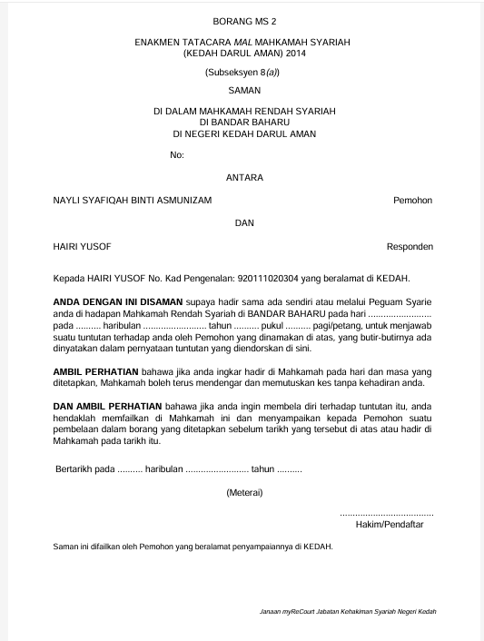

# Panduan Cetak Borang Permohonan

::: info Tujuan
Membantu Admin HQ dan Admin IT untuk mencetak borang permohonan yang perlu diproses.
:::

## Langkah-langkah Mencetak Borang

### 1. Akses Menu Senarai Permohonan

::: tip Langkah 1
1. Klik menu "Senarai Permohonan" pada menu utama
2. Sistem akan memaparkan senarai semua permohonan yang pernah dibuat oleh pengguna
:::

### 2. Cetak Borang Permohonan

::: tip Langkah 2
1. Cari permohonan yang ingin dicetak dalam senarai
2. Klik ikon  pada kolum Tindakan
3. Ikon cetak hanya akan muncul untuk permohonan yang telah berjaya dihantar oleh pengguna awam
:::

### 3. Format Borang PDF

::: tip Langkah 3
Sistem akan memaparkan borang dalam format PDF yang mengandungi:
- Maklumat lengkap permohonan
- Butiran pemohon
- Butiran permohonan
- Tarikh dan masa permohonan
- Nombor rujukan permohonan
:::

::: warning Nota Penting
- Pastikan permohonan telah dihantar sebelum cuba mencetak
- Borang yang belum dihantar tidak mempunyai ikon cetak
- Format PDF memudahkan penyimpanan dan pencetakan borang
- Borang yang dicetak adalah dalam format rasmi yang diiktiraf oleh mahkamah
::: 