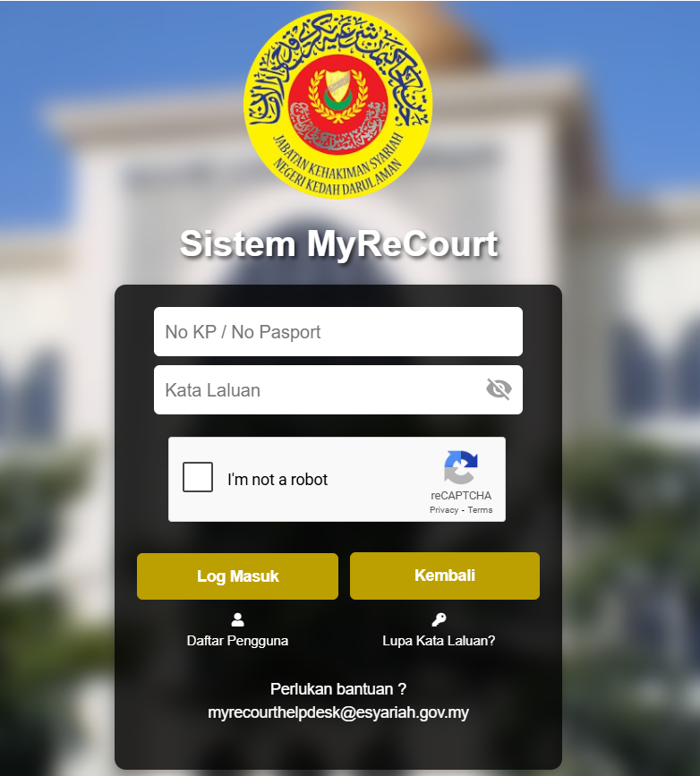
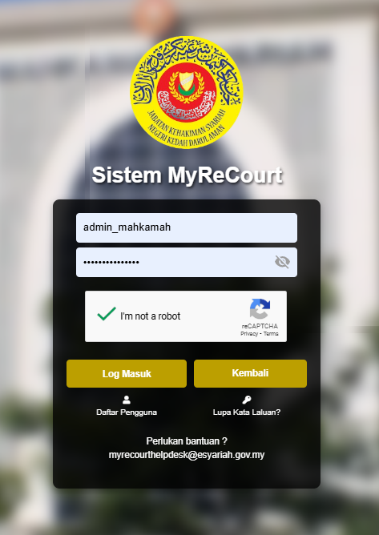

# Panduan Log Masuk

::: info Tujuan
Membantu pengguna admin untuk log masuk ke dalam sistem MyReCourt menggunakan ID pengguna dan kata laluan yang telah didaftarkan.
:::

## Langkah-langkah Log Masuk

### 1. Akses Sistem MyReCourt

::: tip Langkah 1
1. Buka pelayar web Chrome
2. Layari URL: [https://myrecourt.kedah.gov.my/login.php](https://myrecourt.kedah.gov.my/login.php)
3. Anda akan melihat paparan log masuk sistem
:::

### 2. Log Masuk ke Sistem

::: tip Langkah 2
1. Masukkan ID pengguna admin yang telah didaftarkan (contoh: admin_mahkamah)
2. Masukkan kata laluan anda
3. Tandakan kotak "I'm not a robot" untuk pengesahan reCAPTCHA
4. Klik butang **LOG MASUK** untuk masuk ke dalam sistem
:::

::: warning Nota Penting
- Pastikan ID pengguna dan kata laluan yang dimasukkan adalah tepat
- Sekiranya anda menghadapi masalah log masuk, sila hubungi:
  - Email: myrecourthelpdesk@esyariah.gov.my
- Jangan kongsi ID pengguna dan kata laluan anda dengan orang lain
- Log keluar setelah selesai menggunakan sistem
- Tukar kata laluan secara berkala untuk keselamatan akaun
:::

### 3. Penyelesaian Masalah Log Masuk

::: tip Langkah 3
Sekiranya menghadapi masalah log masuk, sila ikut langkah-langkah berikut:

1. **Lupa Kata Laluan**
   - Klik pada pautan "Lupa Kata Laluan?" di bahagian bawah skrin
   - Ikut langkah-langkah yang diberikan untuk menetapkan semula kata laluan

2. **Gagal Log Masuk**
   - Pastikan Caps Lock tidak diaktifkan
   - Periksa sambungan internet anda
   - Kosongkan cache pelayar web jika perlu

3. **Masalah reCAPTCHA**
   - Segarkan semula halaman
   - Pastikan JavaScript dibenarkan dalam pelayar web anda
::: 