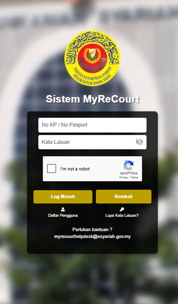
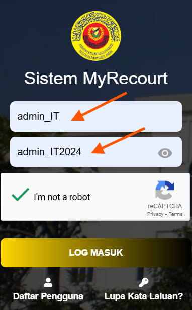

# Panduan Pengurusan Rujukan

::: info Tujuan
Membantu Admin HQ untuk menambah dan mengemaskini maklumat rujukan (lookup) dalam sistem MyReCourt.
:::

## Langkah-langkah Pengurusan Rujukan

### 1. Akses Sistem MyReCourt

::: tip Langkah 1
1. Buka pelayar web Chrome
2. Layari URL: [https://myrecourt.kedah.gov.my/](https://myrecourt.kedah.gov.my/)
3. Anda akan melihat paparan log masuk sistem
:::

### 2. Log Masuk Sebagai Admin HQ

::: tip Langkah 2
1. Masukkan ID pengguna admin HQ
2. Masukkan kata laluan
3. Tandakan kotak "I'm not a robot"
4. Klik butang **LOG MASUK**
:::

### 3. Akses Menu Pengurusan Rujukan

::: tip Langkah 3
1. Klik menu "Pentadbir Pengguna"
2. Pilih submenu "Pengurusan Rujukan"
:::

### 4. Pilih Kategori Rujukan

::: tip Langkah 4
1. Sistem akan memaparkan halaman Pengurusan Rujukan
2. Pilih kategori rujukan yang ingin dikemaskini (contoh: LOKASI - DAERAH)
:::

### 5. Lihat Senarai Rujukan

::: tip Langkah 5
1. Klik butang  untuk melihat senarai rujukan sedia ada
2. Sistem akan memaparkan senarai rujukan yang telah didaftarkan
:::

### 6. Tambah Rujukan Baharu

::: tip Langkah 6
1. Klik butang  untuk menambah rujukan baharu
2. Isi maklumat yang diperlukan:
   - Code: Kod yang akan disimpan dalam table borang
   - Description: Keterangan yang akan dipaparkan kepada pengguna
   - Status: Pilih 'Aktif' untuk rujukan yang boleh diguna atau 'Tidak Aktif' untuk rujukan yang tidak tersedia
3. Klik butang  untuk menyimpan rujukan baharu
:::

### 7. Kemaskini Rujukan Sedia Ada

::: tip Langkah 7
1. Klik ikon  pada kolum Tindakan untuk rujukan yang ingin dikemaskini
2. Kemaskini maklumat yang dibenarkan:
   - Code: Tidak boleh diubah kerana mungkin telah digunakan dalam permohonan
   - Description: Boleh dikemaskini kerana hanya label paparan
   - Status: Boleh diubah untuk mengawal keterlihatan rujukan
3. Klik butang  untuk menyimpan kemaskini
:::

::: warning Nota Penting
- Kod rujukan tidak boleh diubah setelah digunakan dalam permohonan
- Pastikan keterangan (Description) yang dimasukkan adalah jelas dan mudah difahami
- Gunakan status 'Tidak Aktif' untuk rujukan yang tidak lagi digunakan
- Sebarang perubahan pada rujukan akan memberi kesan kepada borang permohonan
::: 