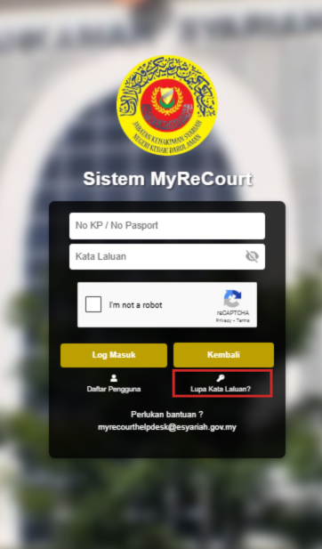

# Panduan Reset Kata Laluan Pengguna

::: info Tujuan
Membantu Admin HQ untuk menetapkan semula kata laluan pengguna dalam sistem MyReCourt.
:::

## Langkah-langkah Reset Kata Laluan

### 1. Akses Sistem MyReCourt

::: tip Langkah 1
1. Buka pelayar web Chrome
2. Layari URL: [https://myrecourt.kedah.gov.my/](https://myrecourt.kedah.gov.my/)
3. Anda akan melihat paparan log masuk sistem
:::

### 2. Log Masuk Sebagai Admin HQ

::: tip Langkah 2
1. Masukkan ID pengguna admin HQ
2. Masukkan kata laluan
3. Tandakan kotak "I'm not a robot"
4. Klik butang **LOG MASUK**
:::

### 3. Akses Menu Pengurusan Pengguna

::: tip Langkah 3
1. Klik menu "Pentadbir Pengguna"
2. Pilih submenu "Pengurusan Pengguna"
:::

### 4. Carian Pengguna

::: tip Langkah 4
Sistem akan memaparkan:
- Bahagian carian pengguna
- Senarai pengguna berdaftar dalam sistem
:::

### 5. Kemaskini Kata Laluan

::: tip Langkah 5
1. Klik butang 
 pada pengguna yang ingin ditetapkan semula kata laluan
2. Sistem akan memaparkan borang kemaskini pengguna
:::

### 6. Tetapkan Kata Laluan Baharu

::: tip Langkah 6
1. Isi kedua-dua medan di bahagian "Tetap Semula Kata Laluan":
   - Kata Laluan Pengguna (Kata Laluan Baru)
   - Kata Laluan Pengguna (Masuk Semula Kata Laluan Baru)
2. Klik butang  untuk menetapkan kata laluan baharu
3. Klik butang jika ingin membatalkan proses
:::

::: warning Nota Penting
- Pastikan kata laluan baharu memenuhi syarat keselamatan sistem
- Pengguna akan menerima notifikasi emel bahawa kata laluan mereka telah ditetapkan semula
- Maklumkan kata laluan baharu kepada pengguna melalui saluran yang selamat
- Ingatkan pengguna untuk menukar kata laluan selepas log masuk pertama
::: 