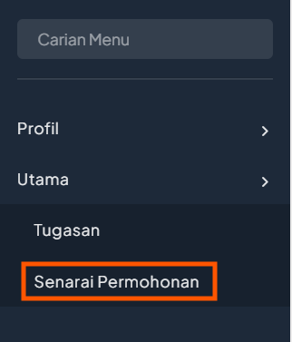
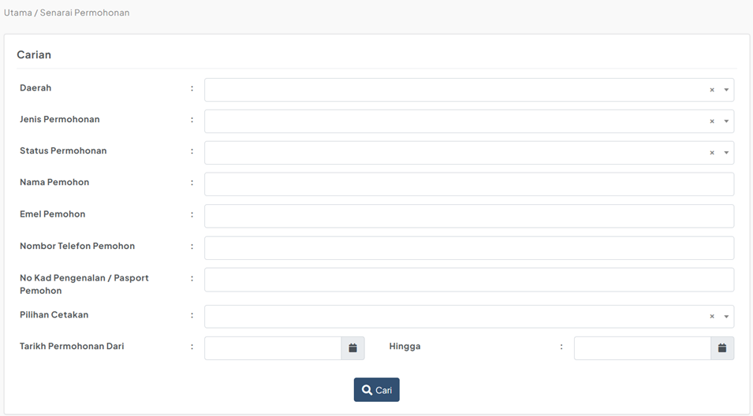
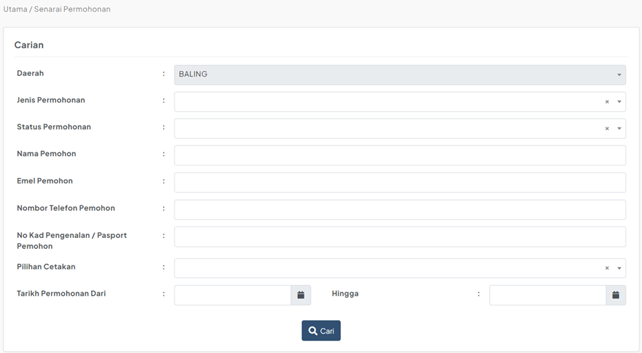
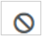

# Panduan Senarai Permohonan

::: info Tujuan
Membantu Admin HQ dan Admin Daerah untuk menyemak sejarah permohonan dan membuat tindakan berdasarkan status permohonan semasa.
:::

## Langkah-langkah Semakan Permohonan

### 1. Akses Menu Senarai Permohonan

::: tip Langkah 1
1. Klik menu "Senarai Permohonan" pada menu utama
2. Sistem akan memaparkan senarai semua permohonan yang pernah dibuat oleh pengguna
:::

### 2. Carian Permohonan

::: tip Langkah 2
Terdapat dua jenis akses carian berdasarkan peranan:

**Admin HQ**
- Boleh membuat carian menggunakan kriteria berikut:
  - Daerah
  - Jenis Permohonan
  - Status Permohonan
  - Nama Pemohon
  - Emel Pemohon
  - Nombor Telefon Pemohon
  - No Kad Pengenalan/Pasport Pemohon
  - Tarikh Permohonan (Dari – Hingga)

**Admin Daerah**
- Hanya boleh membuat carian untuk daerah mereka sahaja
- Daerah lain tidak akan dipaparkan dalam pilihan carian

:::

### 3. Penggunaan Ikon Tindakan

::: tip Langkah 3
Pada kolum Tindakan, terdapat dua jenis ikon:

1.  **Ikon Ban**
   - Menunjukkan permohonan belum dihantar oleh pengguna
   - Admin tidak boleh mengambil sebarang tindakan

2.  **Ikon Cetak PDF**
   - Membolehkan pencetakan borang dalam format PDF
   - Boleh digunakan untuk semua permohonan yang telah dihantar
   - Tersedia untuk kedua-dua jenis cetakan:
     - CETAK SENDIRI
     - CETAK DI MAHKAMAH
:::

::: warning Nota Penting
- Untuk mengemaskini maklumat permohonan, sila gunakan menu Tugasan
- Admin Daerah hanya boleh melihat permohonan untuk daerah mereka sahaja
- Permohonan yang belum dihantar tidak boleh diambil tindakan
- Semua permohonan yang telah dihantar boleh dicetak tanpa mengira status
::: 