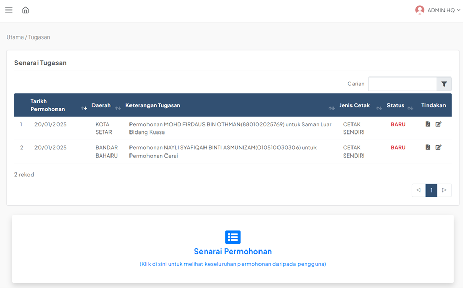
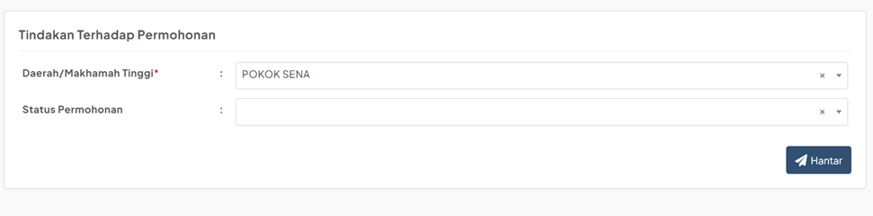
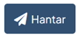
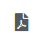
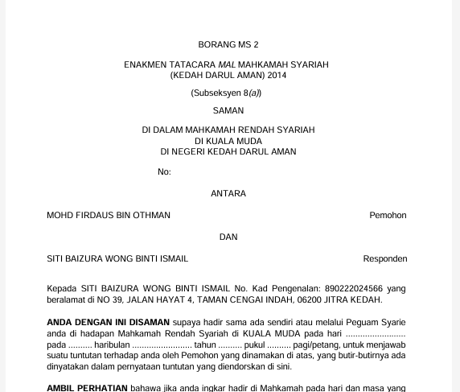

# Panduan Melihat dan Menguruskan Tugasan

::: info Tujuan
Membantu Admin HQ dan Admin Daerah untuk melihat tugasan dan mengemaskini borang permohonan yang telah dihantar oleh pengguna awam.
:::

## Langkah-langkah Pengurusan Tugasan

### 1. Log Masuk ke Sistem

::: tip Langkah 1
1. Log masuk sebagai Admin HQ atau Admin Daerah
2. Masukkan ID pengguna dan kata laluan
3. Tandakan kotak "I'm not a robot"
4. Klik butang **LOG MASUK**
:::

### 2. Paparan Senarai Tugasan

::: tip Langkah 2
Selepas log masuk, sistem akan memaparkan senarai tugasan:
- Admin HQ: Dapat melihat semua permohonan dari semua daerah
- Admin Daerah: Hanya dapat melihat permohonan untuk daerah mereka sahaja
:::

### 3. Tindakan Terhadap Tugasan

::: tip Langkah 3
Pada kolum Tindakan, terdapat dua pilihan:
1. Klik ikon  untuk:
   - Mengemaskini maklumat borang
   - Menetapkan status borang
   - Menukar daerah permohonan
2. Klik ikon untuk mencetak borang dalam format PDF
:::

### 4. Kemaskini Borang Permohonan

::: tip Langkah 4
1. Klik ikon  untuk melihat borang lengkap
2. Kemaskini maklumat borang jika perlu
3. Di bahagian "Tindakan Terhadap Permohonan":
   - Pilih daerah (jika perlu hantar ke daerah lain)
   - Pilih status permohonan yang sesuai
:::

### 5. Status Permohonan

::: tip Langkah 5
Klik butang  untuk mengemaskini status:

1. **Perlu Dihantar ke Daerah Lain**
   - Borang akan dihantar ke daerah baharu
   - Hilang dari senarai tugasan daerah asal

2. **Dikemaskini**
   - Borang kekal dalam senarai tugasan
   - Sesuai untuk kemaskini maklumat sahaja

3. **Dicetak & Selesai Proses**
   - Borang hilang dari senarai tugasan
   - Boleh dicetak melalui menu Senarai Permohonan
:::

### 6. Mencetak Borang

::: tip Langkah 6
1. Klik ikon   untuk mencetak borang
2. Sistem akan memaparkan borang dalam format PDF
3. Borang boleh dicetak atau disimpan
:::

::: warning Nota Penting
- Pastikan status yang dipilih adalah tepat kerana ia akan mempengaruhi aliran kerja permohonan
- Setiap perubahan status akan memberi kesan kepada visibiliti borang dalam senarai tugasan
- Borang yang telah selesai proses masih boleh dicetak melalui menu Senarai Permohonan
- Admin Daerah hanya boleh melihat dan menguruskan permohonan untuk daerah mereka sahaja
::: 